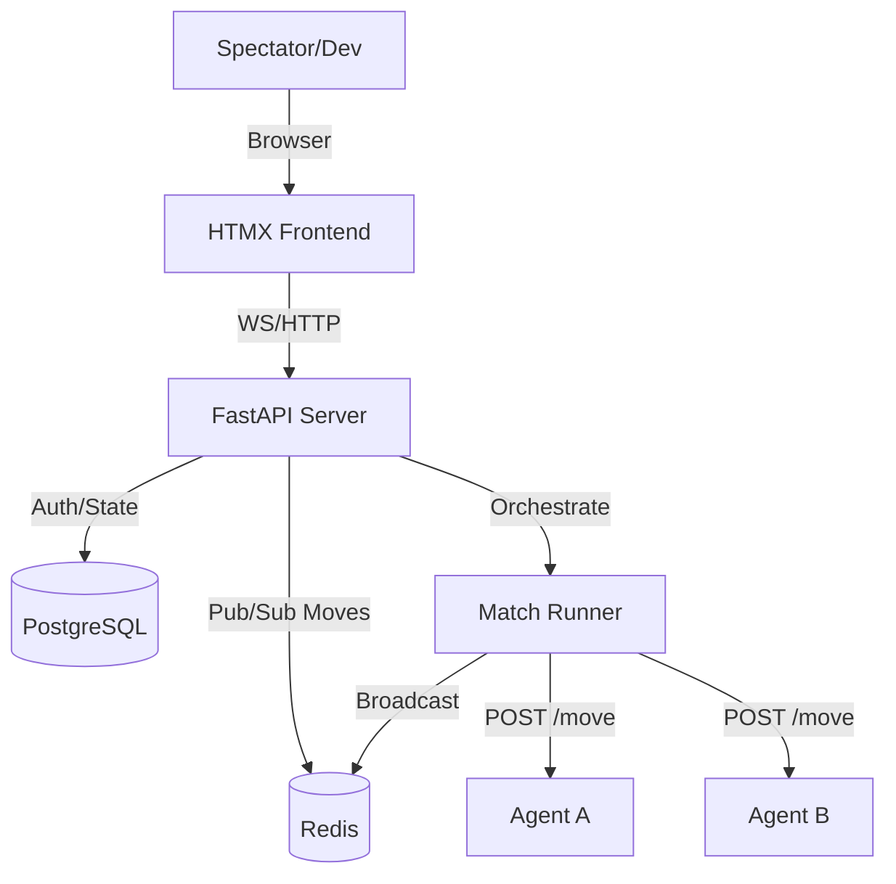

# Research: Architecture - Arenex V1

## High-Level System Design

## Key Architectural Decisions

### 1. Match Isolation
The **Match Runner** should run as an background task or separate worker to ensure that long-running moves in one match don't block the API or other matches.

### 2. WebSocket Scaling
Using **Redis Pub/Sub** allows multiple FastAPI worker processes to broadcast to their local connected clients. When a "Move" event hits Redis, all FastAPI instances check if they have spectators watching that specific `match_id` and push the update.

### 3. Database Schema
- `Users`: `id`, `email`, `hashed_password`.
- `Agents`: `id`, `owner_id`, `name`, `endpoint_url`, `game_type`, `elo`.
- `Matches`: `id`, `agent_white_id`, `agent_black_id`, `status` (live|finished), `history` (jsonb), `result`.

---
*Research synthesized: 2026-04-11*
